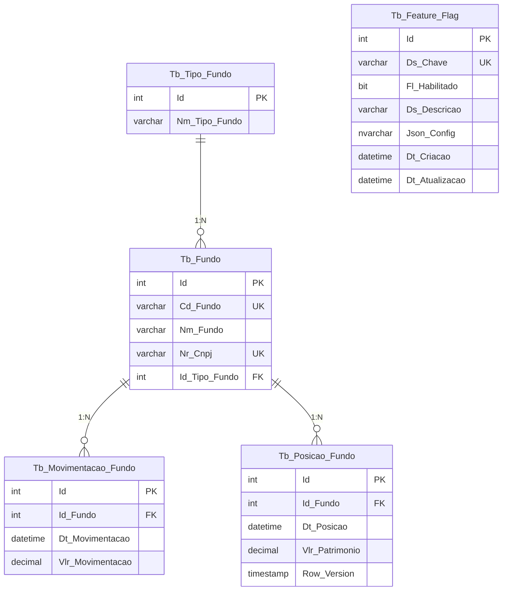
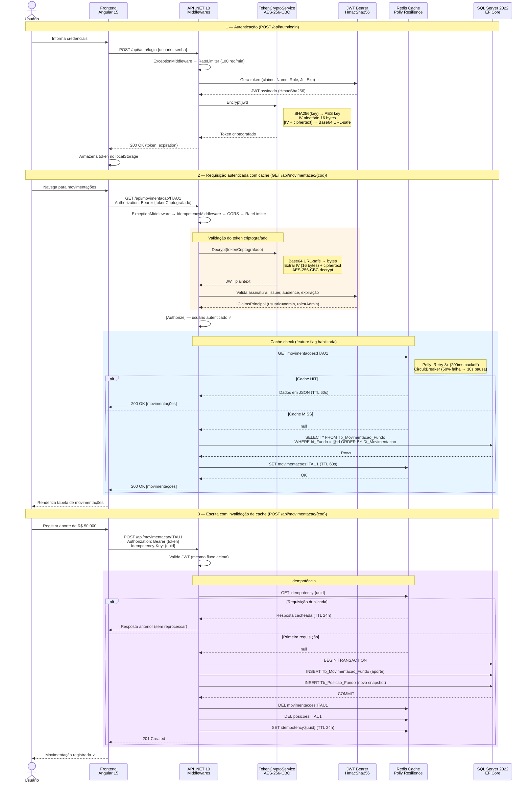

# Case de engenharia Itau - .Net (Itau Asset Management)

Este fork consiste no desafio recebido de um backend legado (.NET Core 3.1 com SQLite) contendo uma API de fundos.

Os pontos propostos foram:

- Refatorar o código utilizando boas práticas, bibliotecas adequadas e padrões de projeto.
- Identificar e corrigir o bug: após inclusão de um novo fundo via API, os métodos `GET` retornavam erro.
- Criar uma aplicação web em **Angular** que consuma todos os métodos da API.

---

## O que desenvolvi

### 1. Refatoração do backend

O código legado tinha SQL Injection em todos os endpoints, connection leak, sem validações, sem autenticação, sem testes e sem arquitetura. Migrei para Clean Architecture com .NET 10 (LTS), SQL Server, EF Core, JWT, Redis, 56 testes unitários e Docker.

### 2. Bug corrigido

O POST inseria `NULL` na coluna `PATRIMONIO`. O GET fazia `decimal.Parse(reader[4].ToString())` — quando NULL, `decimal.Parse("")` lançava `FormatException`, crasheando a API para todos os fundos.

**Indo além:** a coluna `PATRIMONIO` foi removida da tabela `FUNDO` e substituída por duas novas tabelas: `Tb_Movimentacao_Fundo` (registro individual de cada aporte/resgate) e `Tb_Posicao_Fundo` (snapshot diário do patrimônio). Isso normaliza a origem do dado, introduz rastreabilidade histórica e elimina o bug na raiz.

### 3. Frontend Angular

Aplicação web em Angular 15 (Nebular/ngx-admin) que consome todos os endpoints da API: autenticação, cadastro de fundos, movimentação patrimonial e consulta de posições.

---

## Modelo de Dados



---

## Fluxo da Aplicação



---

## Arquitetura

```
CaseItau_Backend/
├── src/
│   ├── CaseItau.API           -> Controllers, Middlewares, DI, Swagger
│   ├── CaseItau.Application   -> Services, DTOs, Validators, AutoMapper
│   ├── CaseItau.Domain        -> Entidades, Interfaces, Exceções
│   └── CaseItau.Infra         -> EF Core, Repositórios, Migrations
└── tests/
    └── CaseItau.Tests         -> 56 testes (xUnit, Moq, FluentAssertions)

CaseItau_FrontEnd/             -> Angular 15 (Nebular/ngx-admin)
```


---

## Stack

| Backend | Frontend |
|---|---|
| .NET 10 (LTS), SQL Server 2022, EF Core 10 | Angular 15, Nebular/ngx-admin |
| JWT Bearer + AES-256-CBC, FluentValidation, AutoMapper | HttpClient com interceptors JWT |
| Redis + Polly (Retry + Circuit Breaker) | |
| Serilog (Console + AWS CloudWatch) | |
| Swagger, Docker, GitHub Actions, Rate Limiting | |
| Health Checks, Idempotência, Feature Flags, RowVersion | |

---

## Como Executar

### Com Docker (recomendado)

```bash
docker compose up --build
```

> **Tempo estimado do primeiro build: ~3 a 5 minutos** (depende da velocidade de rede e CPU).
>
> O build é demorado porque orquestra **4 containers** do zero:
>
> | Container | O que faz no build | Tamanho aproximado |
> |---|---|---|
> | **SQL Server 2022** | Pull da imagem oficial Microsoft | ~1.5 GB |
> | **Redis 7 Alpine** | Pull da imagem (~13 MB) | ~13 MB |
> | **API .NET 10** | `dotnet restore` + `dotnet publish` multi-stage | ~500 MB (SDK) |
> | **Frontend Angular 15** | `npm install` (~800 deps) + `ng build --prod` + nginx | ~400 MB (node_modules) |
>
> Após o build, o startup inclui: health check do SQL Server (~30s), health check do Redis, aplicação das migrations com seed de dados e inicialização da API. **Builds subsequentes são muito mais rápidos** graças ao cache de layers do Docker.

| Serviço | URL |
|---|---|
| Swagger UI | http://localhost:5000/swagger |
| Frontend | http://localhost:4200 |
| Health Check | http://localhost:5000/health |

O banco é criado automaticamente via Migrations com seed de tipos de fundo, fundos, posições e movimentações de exemplo.

### Sem Docker

```bash
docker compose up sqlserver redis -d

cd CaseItau_Backend && dotnet run --project src/CaseItau.API

cd CaseItau_FrontEnd && npm install && npm start
```

---

## Endpoints

Credenciais: `admin` / `admin123`

| Método | Rota | Descrição | Auth |
|---|---|---|---|
| POST | `/api/auth/login` | Retorna token JWT criptografado | Público |
| GET | `/api/fundo` | Lista fundos (suporta `?page=1&pageSize=20`) | JWT |
| GET | `/api/fundo/{codigo}` | Detalhes de um fundo | JWT |
| POST | `/api/fundo` | Cadastra fundo | JWT |
| PUT | `/api/fundo/{codigo}` | Edita fundo | JWT |
| DELETE | `/api/fundo/{codigo}` | Exclui fundo | JWT |
| POST | `/api/movimentacao/{codigoFundo}` | Registra aporte/resgate | JWT |
| GET | `/api/movimentacao/{codigoFundo}` | Histórico de movimentações | JWT |
| GET | `/api/movimentacao/{codigoFundo}/evolucao-patrimonial` | Evolução patrimonial diária | JWT |
| GET | `/api/tipofundo` | Lista tipos de fundo | JWT |
| GET | `/api/featureflag` | Lista feature flags | JWT |
| PUT | `/api/featureflag/{chave}/toggle?habilitado=true` | Toggle de flag | JWT |
| GET | `/health` | Status SQL Server + Redis | Público |

---

## Testes

```bash
cd CaseItau_Backend && dotnet test
```

56 testes unitários: 37 services, 16 validators, 3 mappings.

---

## Screenshots

**Login**


**CRUD de Fundos**


**Movimentação**


**Posição Patrimonial**


