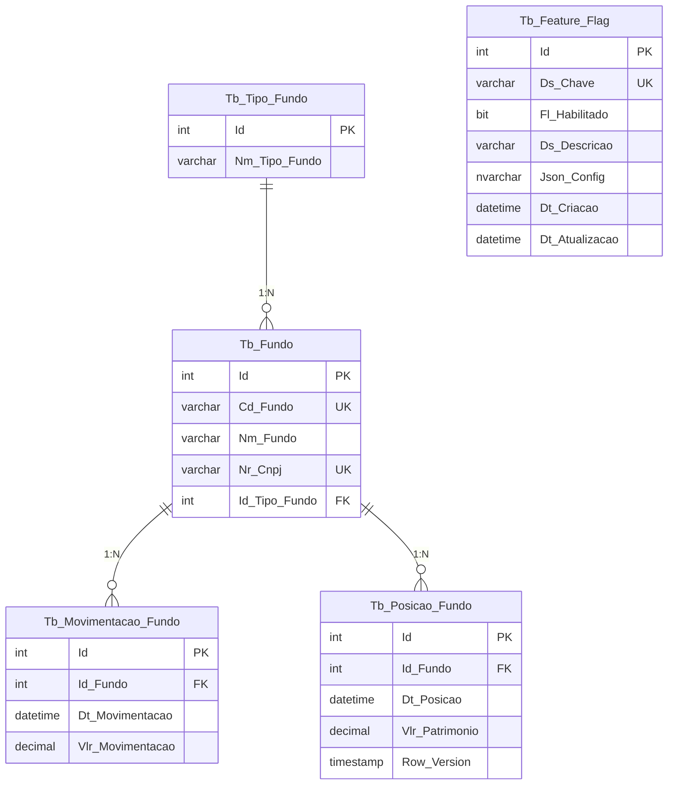
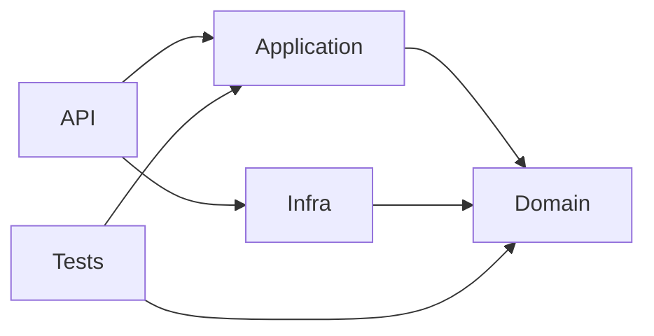

# Case de engenharia Itau - .Net (Itau Asset Management)

Este fork consiste no desafio recebido de um backend legado (.NET Core 3.1 com SQLite) contendo uma API de fundos.

Os pontos propostos foram:

- O código da API de fundos apresenta uso inadequado de objetos, não segue boas práticas e possui baixa qualidade.  
  Refatore a aplicação utilizando boas práticas de desenvolvimento, bibliotecas adequadas, padrões de projeto e mecanismos que garantam a qualidade do software.  
  Fique à vontade para utilizar outros componentes e até mesmo outro banco de dados, caso julgue necessário.
- Após a inclusão de um novo fundo via API, os métodos `GET` da API de fundos passam a retornar erro.  
  Identifique a causa do problema e implemente a devida correção.
- Crie uma aplicação web, em **Angular** ou **ASP.NET MVC**, que consuma todos os métodos da API de fundos.

---

## O que desenvolvi ?

### 1. Refatorei o backend

O código legado tinha diversas controllers com SQL Injection declarado direto no código em todos os endpoints, connection leak, sem validações, sem autenticação, sem testes e sem arquitetura. Decidi migrar para a Clean Architecture (por ser um case pequeno e a Clean não ser tão complexa), com .NET 10, SQL Server, EF Core, JWT, Redis, testes unitários para cobertura e Docker.

### 2. Bug relatado corrigido

No exercício proposto, foi descrito que após a inclusão de um novo fundo via API, os métodos GET estão retornando erro.

Olhando o código inicial e depurando, fica claro que o "POST" inseria `NULL` na coluna `PATRIMONIO`.

Em em seguida era realizado o GET fazia `decimal.Parse(reader[4].ToString())`, quando `PATRIMONIO` era NULL, `reader[4].ToString()` retornava string vazia, e `decimal.Parse("")` lançava `FormatException`, lançando erro na API para todos os fundos.

**Indo além:** Além de corrigir o parse, também foi revista a modelagem para aproximá-la de um cenário real de negócio. A coluna `PATRIMONIO` foi removida da tabela `FUNDO`, pois armazenava um valor agregado e mutável em uma entidade que deveria representar apenas os dados cadastrais do fundo. Em seu lugar, foram criadas duas novas tabelas: `Tb_Movimentacao_Fundo`, responsável por registrar cada movimentação individualmente, e `Tb_Posicao_Fundo`, responsável por manter o histórico diário de posição patrimonial.

Essa mudança traz dois ganhos importantes: primeiro, **normaliza** a origem do dado, fazendo com que o patrimônio passe a ser derivado das movimentações em vez de persistido de forma redundante no cadastro do fundo; segundo, introduz uma **desnormalização controlada** por meio da tabela de posição diária, que armazena snapshots consolidados para facilitar consultas, melhorar performance e preservar rastreabilidade histórica. Com isso, o bug é eliminado na raiz e o modelo passa a refletir melhor a evolução patrimonial do fundo ao longo do tempo, além de permitir a exibição no FrontEnd desses dados históricos.

### 3. Frontend Angular

Aplicação web em Angular 15 (utilizei o Nebular/ngx-admin por ser um Design System completo) que consome todos os endpoints da API: autenticação, cadastro de fundos, movimentação patrimonial, consulta de posições e tipos de fundo.

---

## Refatoração do Modelo de Dados (MER)

Como dito acima, o modelo legado tinha apenas 2 tabelas (`TIPO_FUNDO` e `FUNDO`) com o patrimônio armazenado como uma coluna `NUMERIC` na própria tabela de fundos, sem histórico nem rastreabilidade.

O novo modelo normaliza os dados em 5 tabelas:



**O que mudou em relação ao Case proposto: (MER)** 

| Aspecto | Legado | Refatorado |
|---|---|---|
| Patrimônio | Coluna `NUMERIC` na tabela `FUNDO` | Tabela `Tb_Posicao_Fundo` com snapshot diário |
| Movimentações | `UPDATE FUNDO SET PATRIMONIO = PATRIMONIO + valor` | Tabela `Tb_Movimentacao_Fundo` com registro individual |
| Histórico | Sem histórico, só o valor atual | Evolução patrimonial dia a dia |
| Concorrência | Nenhuma | `RowVersion` na posição para controle de duplicatas |
| Tipos de fundo | Existia no banco mas sem entidade C# | Entidade `TbTipoFundo` com navegação |

---

## Arquitetura Clean Architecture

O backend contém 4 camadas e dependências unidirecionais:

```
CaseItau_Backend/
├── src/
│   ├── CaseItau.API           -> Apresentação (Controllers, Middlewares, DI, Swagger)
│   ├── CaseItau.Application   -> Lógica de aplicação (Services, DTOs, Validators, AutoMapper)
│   ├── CaseItau.Domain        -> Domínio (Entidades, Interfaces, Exceções)
│   └── CaseItau.Infra         -> Infraestrutura (EF Core, SQL Server, Repositórios, Migrations)
└── tests/
    └── CaseItau.Tests         -> Testes unitários (xUnit, Moq, FluentAssertions)

CaseItau_FrontEnd/             -> Frontend Angular 15 (Nebular/ngx-admin)
```

### Fluxo de dependências:



---

## Stack Tecnológica

### Backend

| Categoria | Tecnologia |
|---|---|
| Runtime | .NET 10 (LTS)|
| Banco de dados | SQL Server 2022 |
| ORM | Entity Framework Core 10 com Fluent API |
| Autenticação | JWT Bearer com criptografia AES-256-CBC |
| Validação | FluentValidation 11 com validação real de CNPJ |
| Mapeamento | AutoMapper 12 |
| Cache | Redis 7 com Polly (Retry + Circuit Breaker) |
| Logging | Serilog com sink para Console e AWS CloudWatch |
| Documentação | Swagger / Swashbuckle com suporte a JWT |
| Testes | xUnit, Moq, FluentAssertions — 56 testes |
| Containerização | Docker + Docker Compose |
| CI/CD | GitHub Actions (Para rodar os testes)|
| Resiliência | Polly 8 (Retry com backoff exponencial + Circuit Breaker) |
| Rate Limiting | Fixed Window (100 req/min) |
| Health Checks | SQL Server + Redis |
| Idempotência | Middleware com cache Redis (24h) |
| Feature Flags | CRUD via API com toggle |
| Concorrência | RowVersion (optimistic concurrency) nas posições |

### Frontend

| Categoria | Tecnologia |
|---|---|
| Framework | Angular 15 |
| UI | Nebular (ngx-admin) |
| HTTP | HttpClient com interceptors JWT |

---

## Setup - Como Executar o Case

### Pré-requisitos

- [Docker](https://www.docker.com/) com Docker Compose

### Subindo o ambiente completo

```bash
docker compose up --build
```

Sobe 4 containers:

| Container | Porta | Descrição |
|---|---|---|
| `caseitau-sqlserver` | 1433 | SQL Server 2022 |
| `caseitau-redis` | 6379 | Redis 7 (cache) |
| `caseitau-api` | 5000 | API .NET 10 |
| `caseitau-frontend` | 4200 | Frontend Angular |

O banco é criado automaticamente via EF Core Migrations na inicialização da API, incluindo seed dos tipos de fundo (RENDA FIXA, AÇÕES, MULTI MERCADO) e feature flag do cache Redis.

### Acessando os serviços

| Serviço | URL |
|---|---|
| Swagger UI | http://localhost:5000/swagger |
| Frontend | http://localhost:4200 |
| Health Check | http://localhost:5000/health |

### Executando sem Docker

**Backend:**

```bash
cd CaseItau_Backend
dotnet restore
dotnet build
dotnet run --project src/CaseItau.API
```

Requer SQL Server e Redis rodando localmente (ou suba apenas a infra via Docker, é mais fácil):

```bash
docker compose up sqlserver redis -d
```

**Frontend:**

```bash
cd CaseItau_FrontEnd
npm install
npm start
```

Acesse http://localhost:4200

---

## Endpoints da API

### Autenticação

| Método | Rota | Descrição |
|---|---|---|
| POST | `/api/auth/login` | Autentica e retorna token JWT criptografado (público) |

Credenciais: `admin` / `admin123`

### Fundos (requer JWT)

| Método | Rota | Descrição |
|---|---|---|
| GET | `/api/fundo` | Lista todos os fundos (suporta `?page=1&pageSize=20`) |
| GET | `/api/fundo/{codigo}` | Retorna detalhes de um fundo pelo código |
| POST | `/api/fundo` | Cadastra um novo fundo |
| PUT | `/api/fundo/{codigo}` | Edita um fundo existente |
| DELETE | `/api/fundo/{codigo}` | Exclui um fundo |

### Movimentações (requer JWT)

| Método | Rota | Descrição |
|---|---|---|
| POST | `/api/movimentacao/{codigoFundo}` | Registra aporte ou resgate no patrimônio |
| GET | `/api/movimentacao/{codigoFundo}` | Lista histórico de movimentações |
| GET | `/api/movimentacao/{codigoFundo}/evolucao-patrimonial` | Evolução diária do patrimônio |

### Tipos de Fundo (requer JWT)

| Método | Rota | Descrição |
|---|---|---|
| GET | `/api/tipofundo` | Lista tipos de fundo cadastrados |

### Feature Flags (Configurações registradas em uma Tabela no banco)
As feature flags permitem habilitar ou desabilitar funcionalidades dinamicamente sem necessidade de re-deploy.

| Método | Rota | Descrição |
|---|---|---|
| GET | `/api/featureflag` | Lista todas as flags (requer JWT) |
| GET | `/api/featureflag/{chave}/enabled` | Verifica se está habilitada (público) |
| PUT | `/api/featureflag/{chave}/toggle?habilitado=true` | Habilita/desabilita (requer JWT) |

### Health Check

| Método | Rota | Descrição |
|---|---|---|
| GET | `/health` | Status do SQL Server e Redis (público) |

---

## Testes

56 testes unitários cobrindo a camada de aplicação (Services, Validators, Mappings) com xUnit, Moq e FluentAssertions:

```bash
cd CaseItau_Backend
dotnet test
```

| Categoria | Escopo | Testes |
|---|---|---|
| Services | FundoService, MovimentacaoService, TipoFundoService, FeatureFlagService | 37 |
| Validators | CreateFundo, UpdateFundo, CreateMovimentacao, validação de CNPJ | 16 |
| Mappings | Configuração do AutoMapper | 3 |

---

## Configuração por Ambiente

| Arquivo | Ambiente | Características |
|---|---|---|
| `appsettings.json` | Base | Connection string, JWT, Redis |
| `appsettings.Development.json` | Dev | Debug logging, JWT 120min, configuração `Database:ResetOnStartup` |
| `appsettings.Staging.json` | UAT | Placeholders para CI/CD |
| `appsettings.Production.json` | Produção | Warning logging, JWT 30min, CloudWatch habilitado |

---

## Postman (Faça Download e Importe)

A collection `CaseItau_Backend/CaseItau.postman_collection.json` inclui todos os endpoints com scripts que salvam o token automaticamente.

Baixe e importe o environment `CaseItau_Backend/CaseItau.postman_environment.json` para as variáveis pré-configuradas.